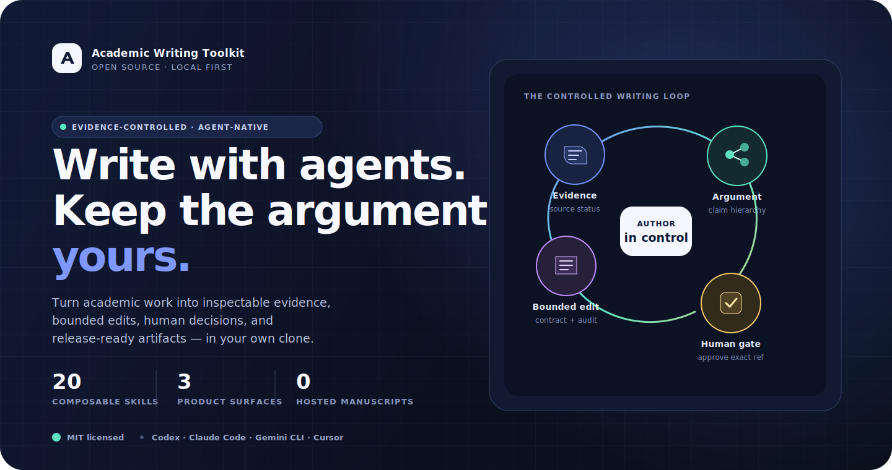
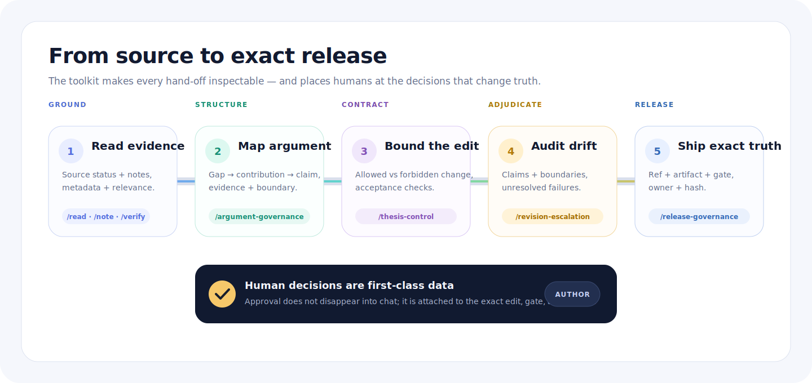
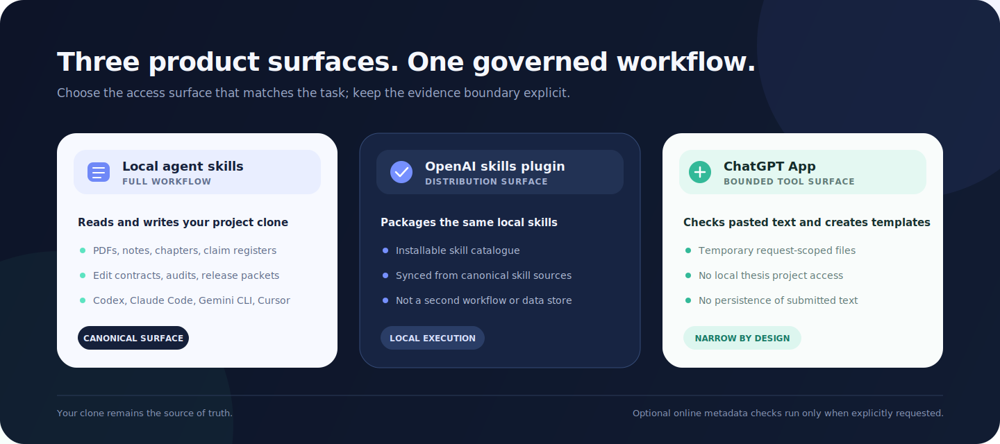

<p align="center">
  
</p>

# Academic Writing Toolkit

[](https://github.com/yha9806/academic-writing-toolkit/actions/workflows/test.yml)
[](https://github.com/yha9806/academic-writing-toolkit/releases/latest)
[](LICENSE)
[](https://agentskills.io)

Academic Writing Toolkit (AWT) is an open-source, local-first system for evidence-controlled academic work. It gives AI agents repeatable skills, inspectable files, and deterministic checks for reading, literature review, argument design, bounded revision, citation auditing, clean-room review, and release governance.

The core promise is simple: **agents may help operate the workflow; the author keeps control of claims, boundaries, approvals, and the exact artifact that ships.**

AWT is not a hosted writing service. It does not upload or store your thesis. Your PDFs, chapters, notes, evidence registers, review packets, and exports stay in your project clone. Online reference metadata checks run only when you explicitly add `--online`.

## Why AWT exists

Long academic projects fail in ways that fluent text alone cannot solve: a citation is remembered but not verified; a claim becomes broader across revisions; a reviewer concern is answered without an evidence anchor; or the released file is not the file that passed review.

AWT turns those risks into visible objects:

| Risk | AWT control |
|---|---|
| Source and citation drift | independent reading notes, source-status labels, BibTeX checks |
| Argument drift | gap → contribution → claim → evidence maps |
| AI revision drift | spine cards, edit contracts, drift audits, human gates |
| Repeated failed edits | three-attempt escalation with stop-and-diagnose semantics |
| Review contamination | clean-room manifests and source-bounded findings |
| Release mismatch | exact ref + artifact + evidence state + gate + owner |

## How the controlled workflow works

<p align="center">
  
</p>

1. **Ground** — read source material, record notes, and distinguish verified support from leads or unknowns.
2. **Structure** — connect the research gap to contributions, claims, evidence, limitations, and reviewer risks.
3. **Contract** — state what an edit may change, what it must preserve, and how acceptance will be checked.
4. **Adjudicate** — compare the result with the approved boundary; unresolved or repeated failure stops the workflow.
5. **Release** — bind approval to an exact Git ref and artifact rather than to a conversational impression.

Human decisions are first-class data throughout the loop. A draft generated by an agent is never silently promoted to author-confirmed evidence.

## Choose the right product surface

<p align="center">
  
</p>

| Surface | Best for | Project access | Persistence |
|---|---|---|---|
| **Local agent skills** | the complete reading, writing, review, and release workflow | reads and writes the clone you opened | normal project files in your clone |
| **Codex plugin** | installing the same local skill catalogue in Codex | the local workspace you authorise | normal project files in your clone |
| **ChatGPT App** | bounded pasted-text checks and template generation | no access to your local thesis project | request-scoped temporary files only |

See [Choose the right product surface](docs/use-cases/choose-product-surface.md) for the detailed boundary.

## Quick start

Use `git clone`, not GitHub's **Download ZIP**. AWT uses symlinks under `.agents/skills/` so compatible local agents discover the same canonical skills.

```bash
git clone https://github.com/yha9806/academic-writing-toolkit.git my-writing-project
cd my-writing-project
make setup
make doctor
```

Open the folder in your agent runtime and ask:

> Show me the available academic-writing skills, explain which files each one reads or writes, and recommend the smallest safe workflow for my task.

Local discovery paths:

| Runtime | Discovery path | Setup guide |
|---|---|---|
| Claude Code | `.claude/skills/` | [Claude Code](docs/setup-claude-code.md) |
| Codex | `.agents/skills/` | [Codex CLI](docs/setup-codex-cli.md) |
| Gemini CLI | `.agents/skills/` | [Gemini CLI](docs/setup-gemini-cli.md) |
| Cursor | `.cursor/rules/` baseline | [Cursor](docs/setup-cursor.md) |

## Run the 10-minute evidence demo

The demo uses fictional public-safe sources. It exercises the same validators used by real projects without requiring network access.

```bash
python3 scripts/verify-refs.py \
  --bib examples/demo-project/references.bib --json

python3 .claude/skills/evidence-review/scripts/check_review_package.py \
  examples/demo-project --strict

python3 .claude/skills/release-governance/scripts/check_release_packet.py \
  examples/demo-project --json

python3 .claude/skills/thesis-control/scripts/check_thesis_control.py \
  examples/thesis-control-revision-escalation/approved --strict --json
```

A valid run reports no blocking issues. Then compare the matched blocked and approved packets in [`examples/thesis-control-revision-escalation/`](examples/thesis-control-revision-escalation/) to see how an author-approved escalation releases a fourth revision.

For multi-turn drift evaluation, [`examples/lost-in-conversation-bench/`](examples/lost-in-conversation-bench/) compares normal editing, consolidated prompting, and `/thesis-control` artifacts across multiple public-safe cases.

## 20 composable skills

| Lane | Skills | What the lane produces |
|---|---|---|
| **Read and ground** | `/read`, `/note`, `/verify`, `/map`, `/evidence-review` | source notes, status labels, gap maps, claim registers, citation-role plans |
| **Design and review the argument** | `/argument-governance`, `/peer-review`, `/self-review` | contribution chains, claim hierarchies, reviewer attack maps, clean-room findings |
| **Write without losing control** | `/integrate`, `/thesis-control`, `/revision-escalation`, `/manuscript-reframe` | approved integrations, edit contracts, drift audits, escalation gates, reframe plans |
| **Audit, package, and release** | `/audit`, `/release-governance`, `/style`, `/logic-review`, `/verify-refs`, `/human-eval-handoff-repair`, `/progress`, `/export` | consistency findings, release packets, reference checks, progress views, Word/ZIP exports |

Detailed, goal-oriented documentation lives in:

- [Skill guides](docs/skills/README.md)
- [Use-case guides](docs/use-cases/README.md)
- [Write a literature review](docs/use-cases/write-literature-review.md)
- [Audit thesis citations](docs/use-cases/audit-thesis-citations.md)
- [Verify references before submission](docs/use-cases/verify-references-before-submission.md)
- [Prepare a release-governance packet](docs/use-cases/prepare-release-governance-packet.md)

## What the checks guarantee — and what they do not

AWT's deterministic helpers verify structural facts that software can check reliably:

- required files, columns, identifiers, links, and allowed status values
- source-note citation shape and in-text citation consistency
- malformed or duplicate BibTeX records
- claim/evidence and clean-room packet structure
- revision-attempt ordering, drift-audit state, and human-gate completeness
- plugin sync, public-content boundaries, local-path leakage, and packaging integrity

They do **not** prove that a scientific claim is true, that evidence is sufficient for a venue, that a paper will be accepted, or that an AI-generated revision expresses the author's intent. Those remain human scholarly judgments.

Safe fixers are deliberately narrow. They may normalise conservative citation punctuation or replace known US spellings with British forms; they do not invent references, rewrite arguments, or mark unresolved evidence as verified.

## Deterministic quality gates

```bash
make doctor             # read-only environment and project health
make test               # 112 regression tests
make plugin-check       # plugin metadata, skill sync, bundled helpers
make chatgpt-app-check  # ChatGPT App server tests

python3 scripts/audit-citations.py --base-dir . --style harvard --json
python3 scripts/audit-british-english.py --base-dir . --json
python3 scripts/audit-logic.py --base-dir . --json
python3 scripts/audit-public-content.py --base-dir .
```

Reference verification is offline by default:

```bash
python3 scripts/verify-refs.py --bib references.bib --json
python3 scripts/verify-refs.py --bib references.bib --json --online
```

The explicit `--online` mode can query Crossref, Semantic Scholar, and arXiv. CI uses local fixtures so the release gate stays deterministic.

## Project structure

```text
my-writing-project/
├── .claude/skills/          canonical local skill sources
├── .agents/skills/          shared discovery links for compatible agents
├── .cursor/rules/           Cursor baseline rules
├── apps/                    bounded ChatGPT App MCP server
├── chapters/                manuscript chapters
├── literature/
│   └── reading_notes/       one structured notes file per source
├── plugins/                 distributable Codex plugin package
├── release/                 optional release-governance packets
├── final_output/            generated Word and ZIP outputs
├── scripts/                 deterministic validators and maintenance tools
├── CLAUDE.md                canonical project configuration
├── AGENTS.md                generated agent configuration
└── GEMINI.md                generated Gemini configuration
```

Edit `CLAUDE.md` for project-specific directories, page limits, British English policy, and citation style, then run `make sync`. Do not edit the generated `AGENTS.md` or `GEMINI.md` blocks by hand.

## Release and distribution

- [Codex plugin publishing checklist](docs/plugin-publishing-checklist.md)
- [OpenAI Codex plugin submission notes](docs/openai-codex-plugin-submission.md)
- [ChatGPT App publishing guide](docs/chatgpt-app-publishing.md)
- [v0.4.0 release-readiness record](docs/product/v0.4.0-release-readiness.md)
- [Privacy policy](docs/privacy.md) and [terms](docs/terms.md)
- [README visual source in Figma](https://www.figma.com/design/HhaFm0uorv5oS7MsezWDN5)

Every release should identify one exact Git ref, the packaged artifact and hash, its evidence state, the gate that approved it, and the owner of any remaining human decision.

## Development

```bash
make sync          # regenerate AGENTS.md and GEMINI.md from CLAUDE.md
make plugin-sync   # regenerate plugin skills from .claude/skills
make repair        # apply narrow, idempotent local repairs
make test
```

The canonical skill source is `.claude/skills/`; plugin copies are generated from it. Finished changes should pass the full quality gates before they are merged or tagged.

## License

MIT. See [LICENSE](LICENSE).
