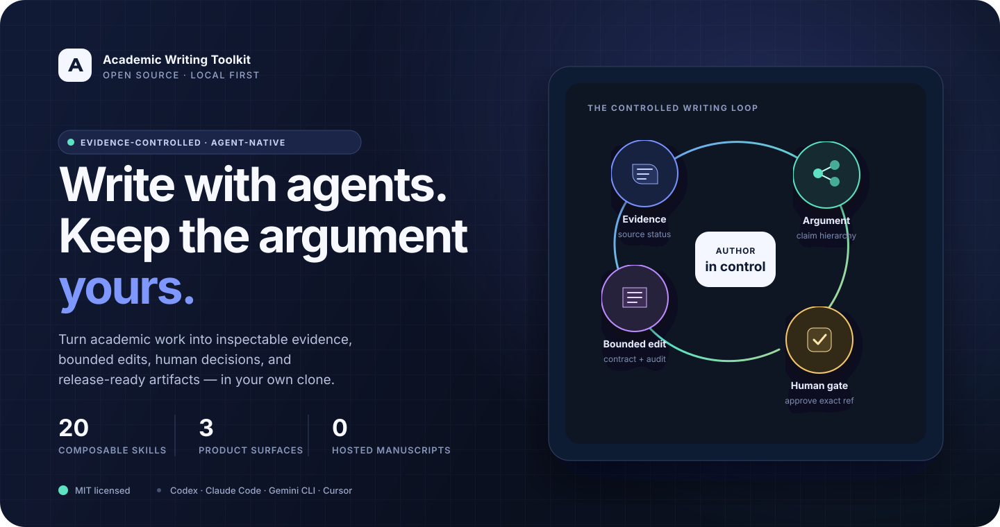
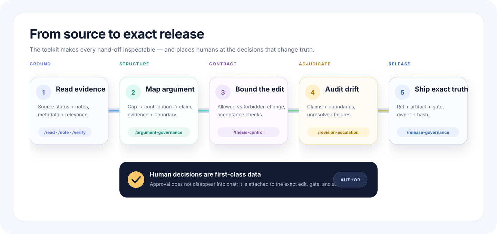
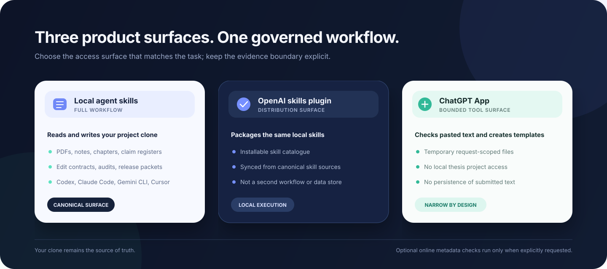

<p align="center">
  
</p>

# Academic Writing Toolkit

[](https://github.com/yha9806/academic-writing-toolkit/actions/workflows/test.yml)
[](https://github.com/yha9806/academic-writing-toolkit/releases/latest)
[](LICENSE)
[](https://agentskills.io)

Academic Writing Toolkit (AWT) is an open-source, local-first system for evidence-controlled academic work. It gives AI agents repeatable skills, inspectable files, and deterministic checks for reading, literature review, argument design, bounded revision, citation auditing, clean-room review, and release governance.

The core promise is simple: **agents may help operate the workflow; the author keeps control of claims, boundaries, approvals, and the exact artifact that ships.**

> **Current stable release: [v0.5.0](https://github.com/yha9806/academic-writing-toolkit/releases/tag/v0.5.0).**
> The local Workbench wheel and Codex plugin are available now. The ChatGPT App
> package is aligned at `0.5.0`, but stable hosted deployment and public App
> distribution remain separate OpenAI review steps; do not treat the App as the
> current stable installation route.

AWT is not a hosted writing service and does not operate a manuscript-storage
backend. Its deterministic tools stay local. The optional Agent-powered local
workbench sends only the manuscript and evidence files you explicitly select to
your configured Codex provider; review that provider's data terms before using
private material. Local sessions and exported copies remain on your machine.
Online reference metadata checks run only when you explicitly add `--online`.

## Why AWT exists

Long academic projects fail in ways that fluent text alone cannot solve: a citation is remembered but not verified; a claim becomes broader across revisions; a reviewer concern is answered without an evidence anchor; or the released file is not the file that passed review.

AWT turns those risks into visible objects:

| Risk | AWT control |
|---|---|
| Source and citation drift | independent reading notes, source-status labels, BibTeX checks |
| Argument drift | gap → contribution → claim → evidence maps |
| AI revision drift | project-intent contracts, global thesis audits, spine cards, edit contracts, human gates |
| Repeated failed edits | three-attempt escalation with stop-and-diagnose semantics |
| Review contamination | clean-room manifests and source-bounded findings |
| Release mismatch | exact ref + artifact + evidence state + gate + owner |

## How the controlled workflow works

<p align="center">
  
</p>

1. **Ground** — read source material, record notes, and distinguish verified support from leads or unknowns.
2. **Structure** — connect the research gap to contributions, claims, evidence, limitations, and reviewer risks.
3. **Contract** — state what an edit may change, what it must preserve, and how acceptance will be checked.
4. **Adjudicate** — compare the result with the approved boundary; unresolved or repeated failure stops the workflow.
5. **Release** — bind approval to an exact Git ref and artifact rather than to a conversational impression.

Human decisions are first-class data throughout the loop. A draft generated by an agent is never silently promoted to author-confirmed evidence.

## Choose the right product surface

<p align="center">
  
</p>

| Surface | Best for | Project access | Persistence |
|---|---|---|---|
| **Local agent skills** | the complete reading, writing, review, and release workflow | reads and writes the clone you opened | normal project files in your clone |
| **Local review workbench** | one author-controlled review from selected files to an explicit new copy | reads only files you choose; never overwrites the source | hash-bound local sessions |
| **Codex plugin** | installing the same local skill catalogue in Codex | the local workspace you authorise | normal project files in your clone |
| **ChatGPT App** | bounded pasted-text checks and template generation | no access to your local thesis project | request-scoped temporary files only |

See [Choose the right product surface](docs/use-cases/choose-product-surface.md) for the detailed boundary.

## Try the local review workbench

The local Workbench is the simplest end-to-end product for an author. It
requires Python 3.9+ and an installed, authenticated Codex CLI. Install the
immutable v0.5.0 wheel directly from GitHub Releases:

```bash
python3 -m venv .venv
.venv/bin/python -m pip install \
  https://github.com/yha9806/academic-writing-toolkit/releases/download/v0.5.0/academic_writing_toolkit-0.5.0-py3-none-any.whl
.venv/bin/awt --check
.venv/bin/awt
```

Open [http://127.0.0.1:8784/](http://127.0.0.1:8784/), then:

1. choose one UTF-8 `.txt`, `.md`, or `.tex` manuscript;
2. select its purpose and one of five tasks;
3. optionally select supporting text, code, data, bibliography, or log files;
4. review each issue and choose accept, modify, reject, or defer;
5. confirm the modification plan before downloading a new reviewed copy.

The original file is never overwritten. The public runtime contains no
`apply-source` mode. Accepting a finding is also not the same as applying text:
only an exact, unique replacement that the user confirms can enter the new
copy.

The workbench uses one lean instruction kernel plus one task card. It does not
inject the full skill catalogue into every model request. Requests that exceed
the local 20,000-token estimate stop before the Agent call rather than silently
expanding context. The five explicit tasks remain available:

- contribution positioning;
- literature integration;
- accuracy checking;
- discussion/evidence alignment;
- whole-manuscript review.

Current limits:

- it uses an installed and authenticated Codex CLI; AWT does not yet ship an
  independent inference backend;
- its unauthenticated HTTP server is deliberately restricted to this computer's
  loopback interface, rejects non-local Host/Origin values, and cannot be
  exposed with `--host 0.0.0.0`;
- only explicitly selected files are available to the Agent;
- PDF and DOCX import are not yet supported by this workbench;
- local estimates are not provider billing records;
- engineering checks verify interaction and file safety, not general writing
  improvement or publication outcomes.

Use `AWT_CODEX_BIN=/absolute/path/to/codex awt` when Codex is not on `PATH`.
Run `awt --version` when reporting a problem and `awt --check` to confirm the
local runner, login state, required Codex flags, and session location without
starting a model request.
Local sessions default to
`~/.local/share/academic-writing-toolkit/sessions` and can be deleted from the
workbench.

## Install the Codex plugin

Use this route when you want the 20 AWT skills inside Codex rather than the
single-review Workbench interface. Current Codex Desktop and Codex CLI builds
support:

```bash
codex plugin marketplace add yha9806/academic-writing-toolkit \
  --ref v0.5.0 \
  --sparse .agents/plugins \
  --sparse plugins/academic-writing-toolkit

codex plugin add academic-writing-toolkit@academic-writing-toolkit
codex plugin list
```

This installs the plugin from the immutable `v0.5.0` tag. It does not install
the Workbench wheel and does not give the ChatGPT App access to local files.
See the [Codex plugin submission and compatibility notes](docs/openai-codex-plugin-submission.md)
if an older Codex build does not expose the `codex plugin` command.

## Use the full repository from source

Use this route when you want the complete skill sources, examples, validators,
and project templates, or when you plan to contribute to AWT. Most authors who
want one manuscript review should use the Workbench above instead.

Use `git clone`, not GitHub's **Download ZIP**. AWT uses symlinks under `.agents/skills/` so compatible local agents discover the same canonical skills.

The primary surface is an agent-native local agent skill workflow: the agent operates explicit files and validators inside the project you opened.

```bash
git clone https://github.com/yha9806/academic-writing-toolkit.git my-writing-project
cd my-writing-project
make setup
make doctor
```

Open the folder in your agent runtime and ask:

> Show me the available academic-writing skills, explain which files each one reads or writes, and recommend the smallest safe workflow for my task.

Local discovery paths:

| Runtime | Discovery path | Setup guide |
|---|---|---|
| Claude Code | `.claude/skills/` | [Claude Code](docs/setup-claude-code.md) |
| Codex | `.agents/skills/` | [Codex CLI](docs/setup-codex-cli.md) |
| Gemini CLI | `.agents/skills/` | [Gemini CLI](docs/setup-gemini-cli.md) |
| Cursor | `.cursor/rules/` baseline | [Cursor](docs/setup-cursor.md) |

## Run the 10-minute demo

The demo uses fictional public-safe sources. It exercises the same validators used by real projects without requiring network access.

```bash
python3 scripts/verify-refs.py \
  --bib examples/demo-project/references.bib --json

npm --prefix guards install
npm --prefix guards run lint:notes -- examples/demo-project/literature/reading_notes/smith2024_NOTES.md
```

A valid run reports no blocking issues. The earlier governance-packet demos
and the lost-in-conversation comparison fixture were retired with their
skills; they remain inspectable under [`archive/skills/`](archive/skills/)
and [`examples/`](examples/) but are no longer presented as evaluations.

## 9 composable skills

The catalogue was triaged from 20 skills to 9 plus 3 reference documents on
2026-08-16 after an adversarial efficacy review (every skill had to beat the
unaided frontier model to stay). See
[`docs/specs/2026-08-16-awt-dsh-app-v0.1-design.md`](docs/specs/2026-08-16-awt-dsh-app-v0.1-design.md)
for the per-skill verdicts; retired skills live under [`archive/skills/`](archive/skills/).

| Lane | Skills | What the lane produces |
|---|---|---|
| **Read and ground** | `/read`, `/note`, `/map` | page-anchored notes with an evidence-status firewall, coverage matrix, progress dashboard |
| **Write without losing control** | `/integrate`, `/edit-contract` | approved integration plans, spine cards, bounded edit scopes, 3-strike escalation |
| **Review and ship** | `/review`, `/audit`, `/verify-refs`, `/export` | anchored review findings, consistency reports, BibTeX checks, Word/ZIP exports |

Reference documents (loaded on demand, no standing prompt cost):
[`references/argument-checklist.md`](references/argument-checklist.md),
[`references/evidence-vocabulary.md`](references/evidence-vocabulary.md),
[`references/reframe-method.md`](references/reframe-method.md).

Detailed, goal-oriented documentation lives in:

- [Skill guides](docs/skills/README.md)
- [Use-case guides](docs/use-cases/README.md)
- [Write a literature review](docs/use-cases/write-literature-review.md)
- [Audit thesis citations](docs/use-cases/audit-thesis-citations.md)
- [Verify references before submission](docs/use-cases/verify-references-before-submission.md)
- [Prepare a release-governance packet](docs/use-cases/prepare-release-governance-packet.md)

## What the checks guarantee — and what they do not

AWT's deterministic helpers verify structural facts that software can check reliably:

- required files, columns, identifiers, links, and allowed status values
- source-note citation shape and in-text citation consistency
- malformed or duplicate BibTeX records
- claim/evidence and clean-room packet structure
- plugin sync, public-content boundaries, local-path leakage, and packaging integrity

They do **not** prove that a scientific claim is true, that evidence is sufficient for a venue, that a paper will be accepted, or that an AI-generated revision expresses the author's intent. Those remain human scholarly judgments.

Safe fixers are deliberately narrow. They may normalise conservative citation punctuation or replace known US spellings with British forms; they do not invent references, rewrite arguments, or mark unresolved evidence as verified.

## Deterministic quality gates

```bash
make doctor             # read-only environment and project health
make test               # regression suite
make plugin-check       # plugin metadata, skill sync, bundled helpers
make chatgpt-app-check  # ChatGPT App server tests

npm --prefix guards test  # notes-contract lint + catalogue truth tests
python3 scripts/audit-public-content.py --base-dir .
```

Reference verification is offline by default:

```bash
python3 scripts/verify-refs.py --bib references.bib --json
python3 scripts/verify-refs.py --bib references.bib --json --online
python3 scripts/verify-refs.py --bib references.bib --json --online --metadata-dir path/to/metadata-fixtures
```

The explicit `--online` mode can query Crossref, Semantic Scholar, and arXiv. CI uses local fixtures so the release gate stays deterministic.

## Project structure

```text
my-writing-project/
├── .claude/skills/          canonical local skill sources
├── .agents/skills/          shared discovery links for compatible agents
├── .cursor/rules/           Cursor baseline rules
├── guards/                  TypeScript notes lint + catalogue truth tests
├── references/              on-demand reference documents
├── archive/skills/          retired skills (deleted in P3)
├── apps/                    bounded ChatGPT App MCP server
├── chapters/                manuscript chapters
├── literature/
│   └── reading_notes/       one structured notes file per source
├── plugins/                 distributable Codex plugin package
├── release/                 optional release-governance packets
├── final_output/            generated Word and ZIP outputs
├── scripts/                 deterministic validators and maintenance tools
├── CLAUDE.md                canonical project configuration
├── AGENTS.md                generated agent configuration
└── GEMINI.md                generated Gemini configuration
```

Edit `CLAUDE.md` for project-specific directories, page limits, British English policy, and citation style, then run `make sync`. Do not edit the generated `AGENTS.md` or `GEMINI.md` blocks by hand.

## Release and distribution

- [v0.5.0 stable release](https://github.com/yha9806/academic-writing-toolkit/releases/tag/v0.5.0)
  — the last release carrying the ChatGPT App, its privacy/terms documents,
  the Cloud Run/Render deployments, and the local workbench wheel; those
  surfaces are decommissioned on main (v0.1 design §13)
- [Codex plugin publishing checklist](docs/plugin-publishing-checklist.md)
- [OpenAI Codex plugin submission notes](docs/openai-codex-plugin-submission.md)
- [README visual source in Figma](https://www.figma.com/design/HhaFm0uorv5oS7MsezWDN5)

Every release should identify one exact Git ref, the packaged artifact and hash, its evidence state, the gate that approved it, and the owner of any remaining human decision.

This repository currently provides open-source, local software. It does not
define a paid subscription, hosted processing service, support SLA, refund
policy, or billing relationship. Those require a separate commercial offer and
customer-facing terms before payment is accepted.

## Development

```bash
make sync          # regenerate AGENTS.md and GEMINI.md from CLAUDE.md
make plugin-sync   # regenerate plugin skills from .claude/skills
make repair        # apply narrow, idempotent local repairs
make test
```

The canonical skill source is `.claude/skills/`; plugin copies are generated from it. Finished changes should pass the full quality gates before they are merged or tagged.

## License

MIT. See [LICENSE](LICENSE).
